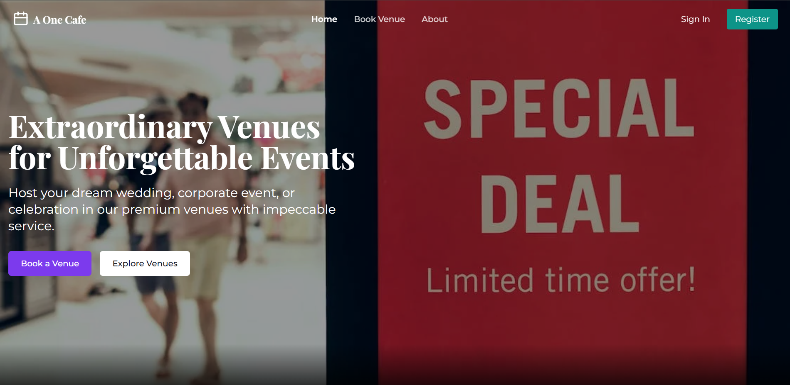

# A One Cafe - Venue Booking System

## Project Overview

A One Cafe is a web application designed to streamline venue booking for events. Users can select event details, check availability, choose packages and menu items, calculate fares, and finalize bookings with OTP-based authentication. Built with Vite, React, Express, Node.js, MySQL, and Sequelize ORM, it offers a robust and scalable solution.

## Project Statement

The application enables users to create a booking by following these steps:

1. **Select Event Date**: Choose the event date.
2. **Select Event Type**: Pick an event type from the `events` table (`id`, `name`, `created_at`, `updated_at`).
3. **Enter Number of Guests**: Specify the number of attendees.
4. **Select Venue**: Choose a venue from the `venues` table (`id`, `name`, `image`, `capacity`, `created_at`, `updated_at`). The form displays the venue's name, image, and capacity.
5. **Select Shift**: Select a shift from the `shifts` table (`id`, `name`, `created_at`, `updated_at`).
6. **Check Availability**:
   - Logic: Checks confirmed bookings in the `bookings` table. If no confirmed bookings exist for the selected date, venue, and shift, the system indicates availability. If a booking exists, the user is prompted to select a different date, venue, or shift.
7. **Select Package**: Displays available packages from the `packages` table (`id`, `name`, `base_price`, `created_at`, `updated_at`), showing name and base price.
8. **Select Menu Items**:
   - Displays menus linked to the package from the `menus` table (`id`, `package_id`, `name`, `items`, `free_limit`, `created_at`, `updated_at`).
   - `items` is a JSON array of menu items with prices.
   - `free_limit` determines free items. Extra items beyond the limit incur additional costs.
   - Implemented using checkboxes.
9. **Check Fare**: Displays the total fare.
10. **Fare Calculation**:
    - Formula: `(package base_price + extra fare for items exceeding free_limit) * guest_count`.
11. **User Details and OTP Verification**:
    - Collects user's name and phone number.
    - Sends an OTP to the user's phone.
    - After OTP verification, creates a user account and saves booking details to the `bookings` table with `pending` status.
    - Admins can update booking status and manage details.

## Screenshots and Demo

- **Screenshot**:
  

- **Video Demo**: [View Video Demo](./readme/readme.mp4)

## Technologies Used

- **Frontend**: Vite, React
- **Backend**: Express, Node.js
- **Database**: MySQL with Sequelize ORM
- **Other**: OTP verification (e.g., Twilio or similar), JSON for menu items

## Database Schema

The application uses the following MySQL tables:

1. **events**
   ```sql
   CREATE TABLE events (
       id INT PRIMARY KEY AUTO_INCREMENT,
       name VARCHAR(255) NOT NULL,
       created_at TIMESTAMP DEFAULT CURRENT_TIMESTAMP,
       updated_at TIMESTAMP DEFAULT CURRENT_TIMESTAMP ON UPDATE CURRENT_TIMESTAMP
   );
